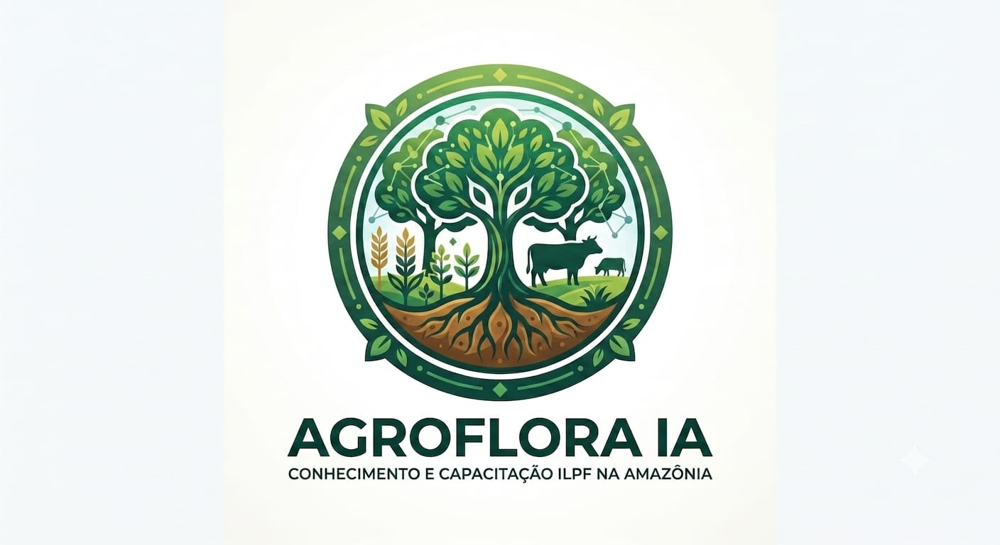

# AGROFLORA IA

Tutora educacional offline sobre Integração Lavoura-Pecuária-Floresta (ILPF) para pequenos e médios produtores da Amazônia. Projeto desenvolvido para o **Build with Gemma: Amazon Eco-Hack**, na UFAC.



## O que já funciona

- interface mobile navegável;
- perfil básico da propriedade;
- chat conectado ao Gemma 3n E2B quando o modelo está disponível;
- busca local (RAG) em uma base técnica, científica e jurídica;
- apresentação das fontes usadas em cada resposta;
- modo de consulta da base quando o Gemma não está iniciado;
- trilha de aprendizagem, quiz e biblioteca local.

O chat não usa respostas pré-programadas. A pergunta passa por uma busca nos trechos locais e o contexto recuperado é enviado ao Gemma. Se o serviço do modelo estiver desligado, a aplicação informa isso e mostra somente os trechos encontrados, sem fingir que houve geração por IA.

## Executar o protótipo

Requisitos:

- Node.js 22.13 ou superior;
- [Ollama](https://ollama.com/download);
- aproximadamente 5,6 GB disponíveis para o modelo `gemma3n:e2b`.

Baixe o modelo uma vez:

```bash
ollama pull gemma3n:e2b
```

Depois execute a aplicação. No Windows, use uma pasta do seu usuário, como
`Documentos`; não clone o projeto dentro de `C:\Windows\System32`.

```powershell
cd "$env:USERPROFILE\Documents"
git clone https://github.com/erico-cristiam/ilpf-offline-agent.git
cd ilpf-offline-agent
npm install
npm run model:check
npm run dev
```

Abra `http://localhost:3000`. Use `npm run dev` para a demonstração local. O
comando `npm run start` é reservado ao build de produção e pode exigir os
bindings da plataforma de hospedagem.

Depois do download inicial, o Ollama, o modelo e a base podem operar sem
internet. Se o comando `ollama` não for reconhecido no Windows, feche e abra o
terminal após a instalação ou execute:

```powershell
& "$env:LOCALAPPDATA\Programs\Ollama\ollama.exe" list
```

## Como a resposta é produzida

```text
Pergunta do produtor
        ↓
Busca lexical na base local
        ↓
Seleção de leis, referências técnicas e artigos
        ↓
Gemma 3n E2B recebe pergunta + contexto + perfil
        ↓
Resposta educacional + fontes recuperadas + alerta técnico
```

Adicionar documentos não exige treinar novamente o Gemma. O arquivo [`knowledge-base/chunks.json`](knowledge-base/chunks.json) funciona como a memória consultável do projeto. Um ajuste fino só seria considerado mais tarde para modificar comportamento, vocabulário ou formato; fatos atualizáveis permanecem no RAG.

## Base de conhecimento

A base inicial reúne:

- Decreto nº 6.514/2008, usando o texto compilado do Planalto;
- Lei nº 12.651/2012;
- material legal fornecido pela equipe;
- referências da Embrapa sobre ILPF na Amazônia e no Acre;
- aula de campo sobre fundamentos técnicos de implantação de ILPF com eucalipto;
- livro `Integração Lavoura-Pecuária-Floresta: Cultivando o Futuro` (Embrapa Pecuária Sudeste, 2026);
- artigo regional `O sistema ILPF na Amazônia`;
- conteúdos de Agrocim, John Deere e Aegro, classificados como divulgação e usados com ressalvas;
- trabalhos de Bonan, Nobre et al., Pitman et al. e Stull.

O PDF fornecido pela equipe está classificado como **referência complementar com revisão pendente**. Ele não substitui o texto legal oficial e não autoriza concluir que ILPF, PRAD ou TAC produzam automaticamente a cessação de embargo ou de multa.

Consulte os critérios em [`knowledge-base/README.md`](knowledge-base/README.md) e o catálogo em [`knowledge-base/sources.csv`](knowledge-base/sources.csv).

## Limites de segurança

A AGROFLORA IA é educacional. Não fornece prescrição agronômica, parecer jurídico ou decisão sobre regularização ambiental. Respostas sobre embargo, APP, Reserva Legal, CAR, PRA e licenciamento devem ser confirmadas com a autoridade ambiental e profissionais habilitados.

## Aplicativo Android

O protótipo web usa Ollama para tornar a integração verificável em um dia de hackathon. A versão Android prevista mantém o mesmo RAG, mas troca o serviço local pela execução do Gemma no aparelho com LiteRT-LM ou runtime compatível.

Mais detalhes: [`docs/architecture.md`](docs/architecture.md).
